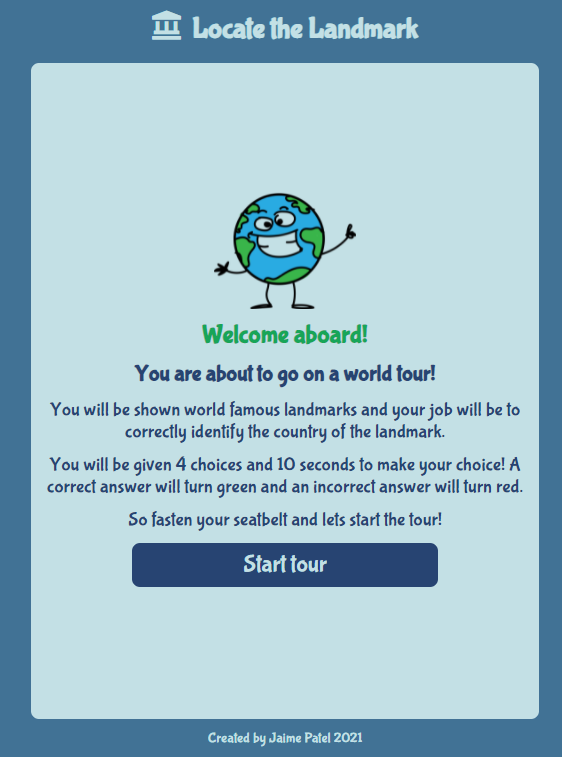

# Locate the Landmark

Locate the Landmark is a multiple choice quiz designed to test the geographical knowledge of users. The users of this quiz will be children of primary school age aged around 10. 

Users are invited to go on a "world tour" through which they are shown landmarks around the world. Their task is to correctly identify and select a landmark's country of origin. Users a given a ten second time frame to choose an answer, before the quiz automatically moves on to the next question. 

Below are images of the interactive site displayed on different screens to illustrate its design responsiveness.

Home display:

Game display:

End game display:

# UX

## Site Owner Goals

The objectives of the site owner are:

* To create a game that is visually appealing to target users.
* To have a theme for the game which is carried through until the end for consistency.
* To deploy a project that is of industry-standard. 

## User Stories

Users would like:

1. To be able to open up the game website  and see a game that is visually appealing from which the concept of the game can easily be understood.
2. To be able to easily navigate to play the game through the use of big buttons which clearly signpost their intent.
3. To be challenged by the content of the game.
4. To get an indication of what questions have been answered correctly and incorrectly.
5. To be given a summary of their performance at the end of the game.
6. To be given a choice of what to do at the end of the game.

## Wireframes

Below are the wireframes that were initially created for this project. The wireframes have been created using [Balsamiq](https://balsamiq.com/wireframes/?gclid=EAIaIQobChMIvd-up7Gq8gIVdgCiAx3NKwsREAAYAiAAEgInd_D_BwE). 

Note: The final design of the project does vary slightly from these initial wireframes but the key concepts are largely the same. The wireframes were created on the iphone container as the project was intended to be designed according to the mobile phone first approach. 

From right to left: 
Home display, Game display, End-game display

# Features

## Existing features

### Generic features

1. Colour
* The colours of the game chosen, represent the colours of the Earth and they were selected from [Canva](https://www.canva.com/colors/color-palette-generator/). These colours not only meet the "world tour" theme but are also eye catching for the younger target audience. 

2. Font-family
* The font-family used throughout this game is "Bubblegum Sans" (see below image). The font was sourced from [google fonts](https://fonts.google.com/). It was chosen because it has a non-formal, bold, appearance.

3. Header 
* Consists of a logo and a heading
* The logo used in the header is of a landmark icon which was sourced from [Font Awesome](https://fontawesome.com/).
* This logo is also used as the favicon for this project. 
* The objective of using this logo is to create a memorable image to enable users to remember the website by. It also projects an indication of the intent of the website.
* The title of the project is simple, catchy and aims to effectively communicate out the intent of the website. 

Header and Favicon:

### Page specific 

1. Home page:

* The home page has a happy, cartoon, world character which is attractive for children and it also carries through the theme of this project. 
* Another aim of the cartoon character is to appear as though they are delivering the instructions of the game, which helps make the instructions easy to digest and less formal.
*  The button used to initiate the game has purposefully been named "Start tour" in order to keep the theme running through the project. It is designed to be bigger than the rest of the paragraph text to highlight its importance. When the button is hovered over, it turns green and the mouse pointer turns to a curser, this is to add some fun element to the button. 

2. Game page:

* The game page has a landmark question counter at the top of the page so that users can know how many questions they need to pass through before the game finishes.
* There is a timer below the landmark question counter to add in a challenge element to the game.
* The landmark image is sizeable so that the user can clearly see the landmark in order to decipher its location. 
* The buttons are styled in the same way as the start tour button on the home page to provide uniformity throughout the project.
* When a choice is correctly selected the button will go green and when a choice is incorrectly selected the button will go red. This provides a quick visual aid to the user about whether they had selected the right answer, without having to use much text. 

4. Buttons 
* All buttons have been designed so that they are big and eyecatching.
* For consistency they have all been styled with the same colour background.
* To give some fun effect to the buttons, a hover effect has been added to the 'Start tour', 'Tour again' and 'Home' buttons so that they change colour when you hover over them. 
* An additional feature of the buttons is that the mouse pointer changes to a curser when you pass over the buttons which further highlights the intent of the buttons. 

