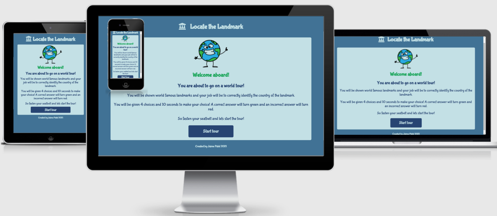

# Locate the Landmark

Locate the Landmark is a multiple choice quiz designed to test the geographical knowledge of users. The users of this quiz will be children of primary school age (around age 10). 

Users are invited to go on a "world tour" through which they are shown landmarks around the world. Their task is to correctly identify and select a landmarks country of origin. Users a given a ten second time frame to choose an answer, before the quiz automatically moves on to the next landmark. 

Below are images of the interactive site displayed on different screens to illustrate its design responsiveness.

Home display:

Game display:

End game display:

# UX

## Site Owner Goals

The objectives of the site owner are:

* To create a game that is visually appealing to target users.
* To have a theme for the game which is carried through until the end for consistency.
* To deploy a project that is of industry-standard. 

## User Stories

Users would like:

* To be able to open up the game website  and see a game that is visually appealing from which the concept of the game can easily be understood.
* To be able to easily navigate to play the game through the use of big buttons which clearly signpost their intent.
* To be challenged by the content of the game.
* To get an indication of what questions have been answered correctly and incorrectly.
* To be given a summary of their performance at the end of the game.
* To be given a choice of what to do at the end of the game.

## Wireframes

Below are the wireframes that were initially created for this project. The wireframes have been created using [Balsamiq](https://balsamiq.com/wireframes/?gclid=EAIaIQobChMIvd-up7Gq8gIVdgCiAx3NKwsREAAYAiAAEgInd_D_BwE). 

Note: The final design of the project does vary slightly from these initial wireframes but the key concepts are largely the same. The wireframes were created on the iphone container as the project was intended to be designed using the mobile phone first approach. 

From left to right: 
Home display, Game display, End game display

# Features

## Existing features

### Generic features

1. Colour
* The colours of the game chosen, represent the colours of the Earth and they were selected from [Canva](https://www.canva.com/colors/color-palette-generator/). These colours not only meet the "world tour" theme but are also eye catching for the younger target audience. 

2. Font-family
* The font-family used throughout this game is "Bubblegum Sans". The font was sourced from [Googlefonts](https://fonts.google.com/). It was chosen because it has a non-formal, bold, appearance.

3. Header 
* Consists of a logo and a heading.
* The logo used in the header is of a landmark icon which was sourced from [Font Awesome](https://fontawesome.com/).
* This logo is also used as the Favicon for this project. It was converted to a favicon icon using [Gauger.io](https://gauger.io/fonticon/) and then referenced into the index html file by following instructions given on [Javatpoint](https://www.javatpoint.com/html-favicon).
* This icon was used as a logo in order to create a memorable image for users to relate back to the game website. It also projects an indication of the intent of the website.
* The title of the project is simple, catchy and aims to effectively communicate out the intent of the website. 

Header and Favicon:

### Page specific 

1. Home display:

* The home page has a happy, cartoon, world character which is attractive for children and it also carries through the theme of this project. 
* Another aim of the cartoon character is to appear as though they are delivering the instructions of the game, which helps make the instructions easy to digest and less formal.
*  The button used to initiate the game has purposefully been named "Start tour" in order to keep the "world tour" theme running through the project. It is designed to be bigger than the rest of the paragraph text to highlight its importance. When the button is hovered over, it turns green and the mouse pointer turns to a curser, this is to add some fun element to the button. The mouse point style turns to pointer style has been added to every button on this project.

2. Game display:

* The game page has a landmark question counter at the top of the page so that users can know how many questions they need to pass through before the game finishes.
* There is a timer below the landmark question counter to add in a challenge element to the game.
* The landmark image is sizeable so that the user can clearly see the landmark in order to decipher its location. 
* The choice buttons are styled in the same way as the start tour button on the home page to provide uniformity throughout the project.
* The user will have to look at the landmark and decide from the button choices which country the landmark is in.
* When a choice is correctly selected the button will go green and when a choice is incorrectly selected the button will go red. The game will then move to the next question. This provides a quick visual aid to the user about whether they had selected the correct answer, without the use of additional text.
* If a user does not select an answer before the timer is up, the display will proceed to the next question or end game screen and this will be noted as an incorrect answer.  

3. End game display:

* The end game page contains a default statement informing the user that the tour is complete.
* The users score is shown to them with an an advice comment; these comments differ according to what result bracket you have scored within.
* Below all of the above text there is a striking emoji that summarises the users performance, which serves as a powerful visual aid, appealing to children. 
* After the user has received feedback about their performance, they can then make an informed decision about whether to tour again or go back to the home page. 
* Both tour again and home options are  buttons which have a hover pseudo class changing the background colour to green when hovered over (same as with the start tour button on the home display).

## Features Left to Implement
If time permitted, I would have liked to:
* Add a link to the home page from the header icon image to make it easier for the user to quit the game at any point.
* Add a username input function, to further personalise the gaming experience for the user.
* Add additional levels into the game, for example have hard and easy levels, to enable users to progress.  

# Testing

* The website has been reviewed on various devices such as laptops, ipads and iphones to ensure the media queries are running as expected (see responsive images at the start of this README file). No major issues reported.

* The website has been tested by myself, my tutor and my husband to ensure that all the elements that the user will interact with or see are working as they should be, such as: 
  * Favicon icon loads as it should.
  * Images and text are appropriately sized.
  * Buttons are able to be pressed and lead
    onto correct paths.
  * The correct landmark number is loading
    when the game proceeds.
  * The correct answers have been assigned 
    to each landmark, preventing users from selecting an incorrect answer as the correct answer.
  * The correct landmark has been assigned
    to the appropriate answer choices.
  * Pseudo class and pointer curser work
    correctly when hovering over buttons
  * If the user selects the correct answer
    button, that button will display green momentarily and then the colour will reset for the next landmark.
  * If the user selects the incorrect answer
    button, that button will display red momentarily and then the colour will reset for the next landmark.
  * If the user answers before
    the timer is up, the display will move onto the next landmark or end game display and the timer will still reset on the next landmark.
  * If the user fails to answer before the timer is up, the display will move onto the next landmark and the timer will reset.
  * The end game summary statements show the
    correct number of landmakrs and display the correct advice comment and image. 

## Bugs

1. Console error
* The first bug that was encountered was when this project was first created, before the initial commit, I wanted to test if the console was logging messages before adding any code into the javascript file.
* After adding a “commited” message into the console, the console did not show the message, however, it showed a ‘Failed to load resource: the server responded with a status of 404 ()'.
* I searched for answers on the internet however nothing worked. Messages that I came across on [Stack Overflow](https://stackoverflow.com/) suggested that re-setting google chrome would resolve the issue, but this did not work.
* After having re-read the console message, I could see the error was due to a favicon.ico so I replaced the default favicon icon with a favicon icon that I wanted to display for my project. This resolved the issue. 

Console error:

Console error resolved:

2. Instruction container hide error
* I wanted to add a hide class to my instruction container once the startGame function was rendered, however the style *although creating no errors in the console) was not being applied to the container and hence not disappearing when the startGame function was activated.
* After speaking to my tutor, it seemed as though the hide class was being overidden by the flex display that was being applied, she suggested to add the css styling to hide a button rather than assigning it a hide class. This resolved the issue.

3. Unused variables detected by JShint.

* After having almost completed my project, I wanted to check my javascript file in JSHint. 
* An error that JShint displayed was for 'Unused variables'. These variables had event listeners attached to them. 
* For example, the startGame variable was declared using the keyword ‘const’ at the beginning of the javascript file. It was later called in a function, by making a reference to the variable name only for examples as follows; ‘start;’. 
* It was realised by the project owner that due to the keyword ‘Const’ has block scope, this would possibly be the reason why it was displaying as an error in JSHint. However, it was unusual to find that this was not detected by the console in developer tools. 
* The project owner removed the keyword from all unused variable names. All these variables were placed in a separate section in javascript. The issue was resolved.

4. Undefined variable detected by JShint 

* This was another issue that was detected by JShint towards the end of the project.
* The undefined variable was being declared in a separate javascript file.
* The project owner overlooked the fact that JShint was not able to know this and it was pointed out by a Tutor at [Code Institute](https://codeinstitute.net/5-day-coding-challenge/?utm_term=code%20institute&utm_campaign=a%26c_SEA_UK_BR_Brand_Code_Institute&utm_source=adwords&utm_medium=ppc&hsa_acc=8983321581&hsa_cam=1578649861&hsa_grp=62188641240&hsa_ad=486298911546&hsa_src=g&hsa_tgt=kwd-319867646331&hsa_kw=code%20institute&hsa_mt=e&hsa_net=adwords&hsa_ver=3&gclid=EAIaIQobChMIorzct4er8gIVGeDtCh2T8QThEAAYASAAEgLlWvD_BwE).
* Thereafter, the code from the separate javascript file was also copied into JSHint, above the main javacript file. The issue was resolved.

Undefined variable - issue:

Undefined variable - issue resolved:

## Validator Testing

* The index.html file was checked on the official W3C Validator - no errors were found.

* The style.css file was checked on the official (Jigsaw) Validator - no errors found.

* The landmarks.js and the script.js files were checked on the official JShint validator, metrics as follows:
  * 17 functions in this site.
  * Function with the largest signature take 1 arguments, while the 
    median is 0.
  * Largest function has 9 statements in it, while the median is 6.
  * The most complex function has a cyclomatic complexity value of 9 while the median is 1.
  * 28 warnings about the use of variable keywords.

* The performance of the website was also checked using Lighthouse on Chrome Developer tools, the result is as below:

## Unfixed bugs

There are no bugs that I have not tried to rectify in javascript.One issue that I would have liked to rectify is to make the landmark images all one size, because at the moment the sizes vary which causes the container box to increase and decrease accordingly, which does not make for a good user experience.

# Deployment

1. Ensure most recent code is pushed to Github from Gitpod workspace.
2. Login to Github.
3. Open up your project repository.
4. Click on the 'Settings' option.
5. Scroll down to 'Github pages'.
6. Under 'Source' click into first box (displayed as 'none') and select a
   branch called 'Main'.
7. Click 'Save' where you be taken back to the 'Settings' page.
8. Scroll down to 'Github pages', where it prompts you to check out 
   "Pages settings' - click this prompt.
9. A message will be displayed, within a green container, at the top of
   the page informing you the address where the site has been published.

The live link to this project can be found at:

https://jpatel87.github.io/locate-the-landmark/

# Credits 

The project forms part of the Code Institute Full Stack Developer course. I would like to give recognition to the Code Institute Tutor team who have been fantastic at answering any queries at any time of the day. My sincere thanks to my Tutor, Owonikoko Oluwaseun, who has been brilliant at trying to help me with my code. My thanks also to my husband for his guidance and support.

## Content 

* The ideas for the landmarks in my project were found on the following websites [designlike](https://designlike.com/100-most-famous-landmarks-around-the-world/#:~:text=%20100%20Most%20Famous%20Landmarks%20Around%20the%20World,India%2012%20Machu%20Picchu%20in%20Peru%20More%20) and [listChallenges](https://www.listchallenges.com/150-most-famous-landmarks-in-the-world)
* To help with my javascript quiz, I took guidance from the following websites: [SimpleStepsCode](https://simplestepscode.com/javascript-quiz-tutorial/#:~:text=%20How%20to%20make%20a%20simple%20JavaScript%20quiz,own%20JavaScript%20quiz.%20You%20have%20the...%20More%20) and [Codeexplained.org](https://www.codeexplained.org/2018/10/create-multiple-choice-quiz-using-javascript.html)

## Media 

* Photos used for the landmarks were taken from [Pexels.com](https://www.pexels.com/)
* The emoji images and the home screen cartoon image were taken from [Pixabay.com](https://pixabay.com/)
* [Font awesome](https://fontawesome.com/) was used to select a logo and then use that as an favicon.
* [Googlefonts](https://fonts.google.com/) was used to select the font for the project.

